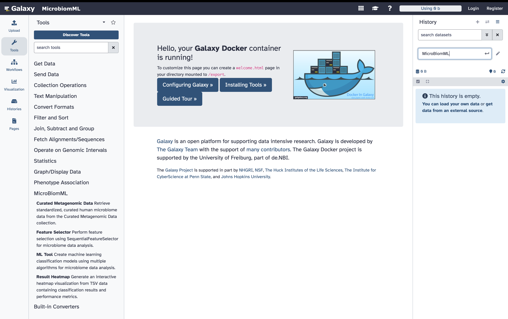
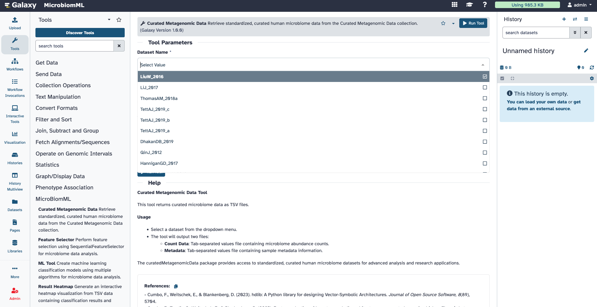

# MicroBiomML

This research explores hyperdimensional computing (HDC), a brain-inspired computational approach, as an alternative to classical machine learning for classifying high-dimensional metagenomic data. We demonstrate that HDC achieves comparable or superior classification accuracy while offering improved computational efficiency on large-scale datasets. Our comprehensive comparison includes HDC against established machine learning techniques across diverse microbiome classification tasks using publicly available datasets. We provide a Galaxy-powered toolset enabling researchers to apply these methods to their own datasets with reproducible workflows and ease of use.

## Citation:

Joshi, J., Cumbo, F., & Blankenberg, D. (2025). Large-scale classification of metagenomic samples: a comparative analysis of classical machine learning techniques vs a novel brain-inspired hyperdimensional computing approach. *bioRxiv* [Preprint], Version 2. https://doi.org/10.1101/2025.07.06.663394


## Docker Image: 

:whale: Galaxy Docker repository for the data analysis with MicrobiomML.



Installed tools: 

 * [Curated Metagenomic Data](https://github.com/jaidevjoshi83/MicroBiomML/tree/master/curated_metagenomic_data)
 * [Feature Selector](https://github.com/jaidevjoshi83/MicroBiomML/tree/master/feature_selection)
 * [ML Tool](https://github.com/jaidevjoshi83/MicroBiomML/tree/master/ml_tool)
 * [Result Heatmap](https://github.com/jaidevjoshi83/MicroBiomML/tree/master/result_heatmap)

To launch:

```
docker run --rm -i -t --privileged -p 8080:80 jayadevjoshi12/microbiomml:latest
```

For persistent data storage:

```
docker run --rm -i -t --privileged -p 8080:80 -v /home/<username>/export.gaiac/:/export jayadevjoshi12/microbiomml:latest
```
Quick tip: 

From the left side tool menu in the `MicroBiomML` tool panel, click on [Curated Metagenomic Data](https://github.com/jaidevjoshi83/MicroBiomML/tree/master/curated_metagenomic_data) tool, as shown in the image below. You can download any dataset by selecting it from the dropdown menu (e.g., LiuW_2016). Once downloaded, you can proceed with downstream machine learning analysis. 



## Install tools from Tool-shed: 

All these tools are available at the Galaxy [tool-shed](https://toolshed.g2.bx.psu.edu/repositories/bf264a9be4402594), and can be installed in your local Galaxy instance.

 * [Curated Metagenomic Data](https://github.com/jaidevjoshi83/MicroBiomML/tree/master/curated_metagenomic_data)
 * [Feature Selector](https://github.com/jaidevjoshi83/MicroBiomML/tree/master/feature_selection)
 * [ML Tool](https://github.com/jaidevjoshi83/MicroBiomML/tree/master/ml_tool)
 * [Result Heatmap](https://github.com/jaidevjoshi83/MicroBiomML/tree/master/result_heatmap)


## Contact

For questions or further information, contact [Jayadev Joshi](mailto:joshij@ccf.org) and [Fabio Cumbo](mailto:cumbof@ccf.org).

## License

This work is distributed under the MIT License.